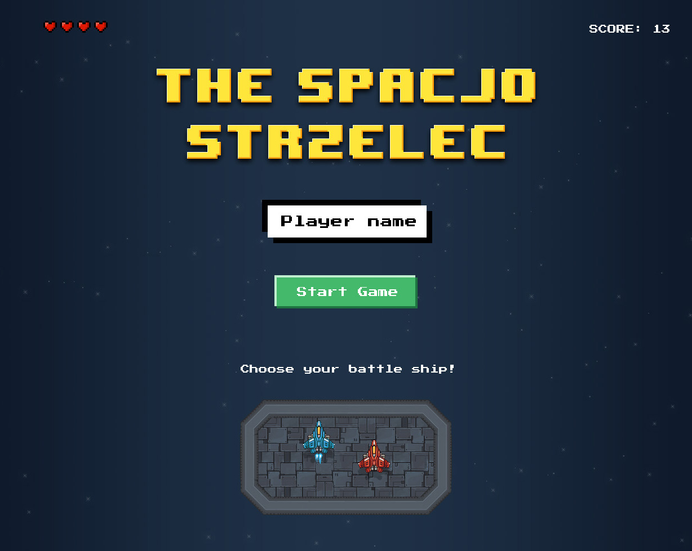

# The Spacjo Strzelec

[Play online](https://schriker.github.io/spacjo/) 

## Classic arcade game project to practice React Hooks

Whole app was build with help of React Hooks API wich was introduced with 16.8.0.  Main goal was to build global state based on Context API and useReducer hook.  So I can omit Redux and still have similar functionality of flux like state control. You can call useContext, pass StateContext from store.js as an argument and be able to dispatch actions, use store.state in  your component. 

## Controls
* Left /Right arrow to move 
* Left mouse button to shoot

## What I use?
App is build with:
* [React](https://reactjs.org/) 
* [AnimeJS](https://animejs.com/) 

## Installation
You can just clone repository files and run to install all dependencies:

`npm install`

After that just run to start:

`npm start`

To build project:

`npm run build`

*All project files are located in ./src/*
#projects